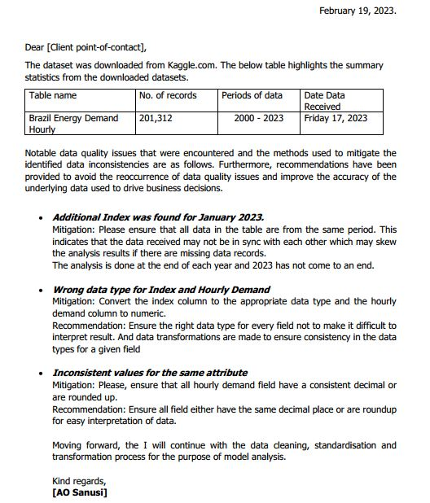
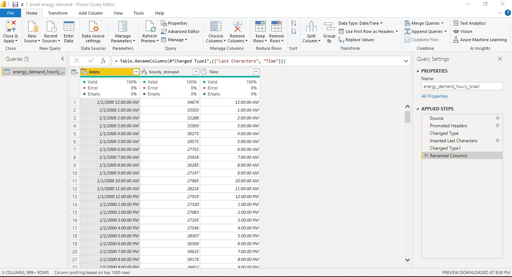
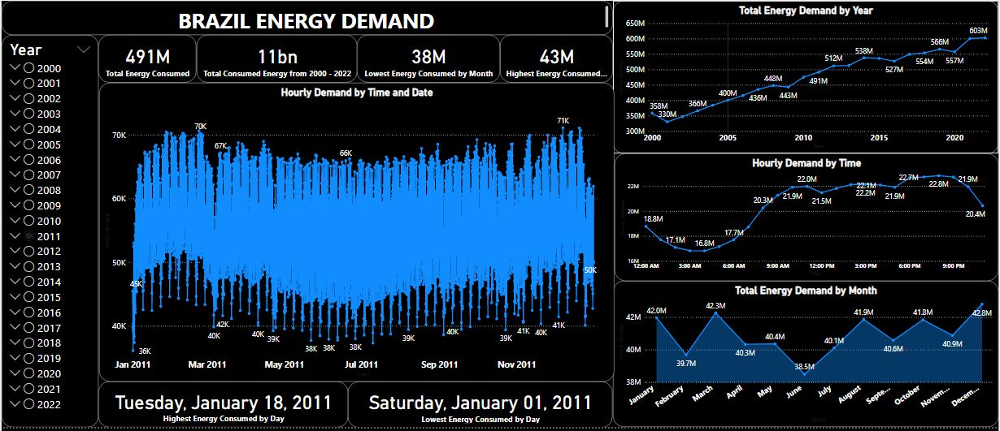

# Brazil-Energy-Demand-Analysis

## INTRODUCTION
This is a **Power BI** project on **Analysis and Visualization on Energy Consumed in Brazil**. The derived insights is to answer crusial questions and help make data driven decisions.

_**Disclaimer**_: All the datasets and reports are fictitious and do not represent any person, institution, country or person, but a dummy dataset to demostrate my **skills** and **capabilities** on Power BI. 😃

## PROBLEM STATEMENT
To analyse and visualise
1. Find the total energy consumed 
    - For each year
    - Total for all year 

2. Find the lowest energy consumed in a month by year and the highest energy consumed in a month by year

2. Find the lowest energy consumed in a day, in a year and highest energy consumed in a day, in a year.  

## DATA QUAITY REPORT
Data quality reporting is the process I used in removing and reorganising all compromising data. 

## DATA SOURCING 
The data was collect from Kaggle.com and it contains 201,312 and 2 fields

   

[Click here for the dataset](https://www.kaggle.com/datasets/arusouza/23-years-of-hourly-eletric-energy-demand-brazil)

## DATA TRANSFORMATION
Data cleaning and transformation was carried out using **Power BI** Query. 
1. _Data in the table are not from the same period; only a month data for 2023 was recorded in the dataset_ **###Cleaning** the one (1) month record for 2023 was removed in other not to skew the data. 
2. _The Index Column was not in the appropriate data type **Cleaning*** The Index data type was changed to date and Hourly, Number. 
3. _Inconsist decimal place_ **Cleaning** all values was rounded up to an whole number. 
4. From the index column, which contains time and date, time was extracted to a seperate column **_Time_** so to analyze the data based on time 

## DATA MODELING 
No modeling was required since its just a table 

## ANALYSIS AND VISUALIZATION

**From the analysis carried out**
Just as they say, the off-peak hours (when demand for power is at its lowest) is in the night between 10pm to 8am. This analysis proved that saying. During the analysis of this project, in no time was the off-peak hours greater than the peak hours. The peak hours is from 9am and rose up. 

1. The total energy consumed from 2000 - 2022 is 11billon watts or 110MW 
2. The least enery consumed from year 2000 - 2022 was in 2001 at 330MW and the Highest energy consumed was in 2022 at 603MW. There was a decline of in 2001 and it rose back up rapidly and efficiency. Further reseacher shows that it was because of a drought that reduced the water level at the hydroelectric dam. 
[Read more](https://www.reuters.com/article/us-brazil-electricity-idUSBRE90818N20130109)
3. The Least energy consumed in months in 2001 was in June, July and it rose up in August and decline back due to the drought and the increase was in March. 

Drill through funtion is used to get month insight in the table.

#_Overview of the Dashboard 
The dashboard can be filtered using slicer to show
- Total energy demand in a year
- Total energy demand in a month
- Highest energy used in a month and which day in that particular month
- Lower energy used in a month and which day in that particular month
- Off-peak hour (when demand for power is at its lowest)
- Peak hour (when demand for power is at its highest)
- Drill through

